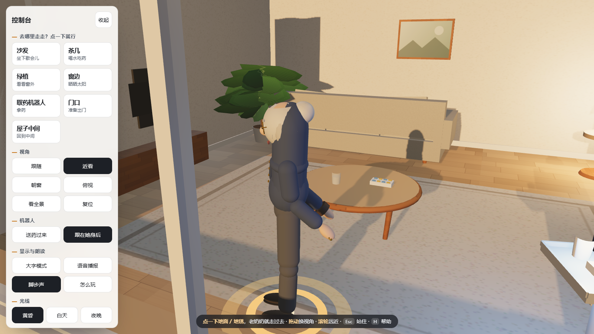

# 点哪走哪 · 老奶奶 3D 网页

用鼠标（或手指）在地板、地毯上点一下，**老奶奶就会转身、迈步走过去**——走到你点的那个位置停下。
人物、机器人、房间全部由代码程序化生成，不依赖任何外部模型文件，断网也能跑。


---

## 怎么玩

| 操作 | 效果 |
| --- | --- |
| **点击地面 / 地毯** | 指定目的地，地上出现光圈标记，老奶奶走过去 |
| **拖动画面** | 绕着房间换视角 |
| **滚轮 / 双指捏合** | 拉近拉远 |
| **左手控制台按钮** | 一键去沙发、茶几、绿植、窗边、取药机器人、门口、屋子中间 |
| **视角：跟随 / 近看 / 朝窗 / 俯视 / 看全景** | 五种取景，跟随模式镜头始终跟着她 |
| **机器人：送药过来** | 机器人开到奶奶面前递上药盒，屏幕转绿；"跟在她身后"让它一路陪着 |
| **光线：黄昏 / 白天 / 夜晚** | 窗外天色、室内光照一起换 |
| **大字模式 / 语音播报 / 脚步声** | 给视力、听力不便的使用者准备的开关 |
| `Esc` | 站住别走了 |
| `H` | 再看一遍说明 |

点在家具上（沙发、柜子…）她会告诉你"**那里有家具，老奶奶走不过去**"，而不会被硬推到旁边。

### 直接打开

双击 `index.html` 即可（全部本地文件，无需服务器、无需联网）。

如果浏览器对本地 `file://` 读取脚本有限制，用项目自带的零依赖静态服务器：

```powershell
D:\node\node.exe tools\serve.mjs 5173
# 然后浏览器打开 http://127.0.0.1:5173/
```

---

## 项目结构

```
grandma-web/
├─ index.html              页面骨架（画布 + 控制台 + 引导卡）
├─ styles/app.css          界面样式（大字号、高对比、可收起、窄屏适配）
├─ src/
│  ├─ grandma.js           老奶奶角色：程序化建模 + 关节骨架 + 走/站动画
│  ├─ robot.js             送药机器人伙伴（白壳 + 黑屏 + 木侧板 + 托盘药盒）
│  ├─ environment.js       客厅场景：房间、家具、地毯、绿植、窗外夕阳城市、三档光照
│  ├─ main.js              主程序：相机、点击走到、状态机、UI、音效、语音
│  └─ glb.js               自写的最小 glTF 2.0 / GLB 导出器
├─ export.html             导出页（把程序化模型烘焙成 GLB）
├─ assets/                 导出的标准模型（SketchUp / Rhino / Blender 可直接打开）
│  ├─ grandma.glb          老奶奶（0.41 × 1.38 × 0.44 m）
│  ├─ grandma-robot.glb    送药机器人（0.51 × 1.27 × 0.71 m）
│  └─ room.glb             客厅家具与墙（8.26 × 3.50 × 6.92 m）
├─ shots/                  13 张成品截图 + 自检报告 _report.json
├─ tools/
│  ├─ serve.mjs            零依赖静态服务器
│  ├─ shot.mjs             无头 Edge 批量截图 + 状态采集
│  ├─ export-glb.mjs       无头 Edge 里导出 GLB
│  ├─ check-glb.mjs        GLB 结构自检（独立解析二进制）
│  └─ shots-run.json       成品截图的脚本化流程
└─ vendor/three.min.js     Three.js r160（UMD，本地）
```

---

## 人物是怎么"长"出来的

没有用任何外部模型，全靠参数化几何 + 关节层级：

- **骨架**：髋 → 腰 → 上胸 → 颈 → 头；髋 → 膝 → 踝 → 脚；肩 → 肘 → 腕 → 手。
  全部用嵌套 `Object3D` 实现，动画直接改关节角度。
- **走路**：髋、膝、踝、肩、肘都按正弦曲线驱动，**步态相位跟着位移推进**，
  所以走多快、步子就迈多大，脚不会打滑。
- **脚不陷地也不悬空**：每帧用正向运动学算出两只脚的最低点，
  再把整个身体抬到"最低脚刚好踩地"，改任何身体比例都自动成立。
- **老人特征**：步伐略慢、幅度小、髋部左右摇摆、略微含胸驼背；
  站定时双手在身前轻握，走路时自然摆臂，两种姿态平滑过渡。
- **细节**：银发发髻 + 金丝圆框眼镜 + 藏青对襟上衣（盘扣）+ 灰色长裤 +
  深棕皮鞋 + 左手腕表，都对应参考照片。



---

## 自检与核验（都留了可复跑的工具）

| 工具 | 回答什么问题 |
| --- | --- |
| `tools/check-glb.mjs` | 导出的 GLB 结构是否合法、能否真解出三角形与包围盒 |
| `tools/shot.mjs` | 各视角画面；页面有无报错；把 `APP.info()` 一并写进 `_report.json` |
| `APP.rig()` | 各关节世界坐标与顶点包围盒（查比例、查穿地） |
| `APP.screen()` | 把关节投影成屏幕坐标（查朝向、查取景） |
| `APP.camInfo()` | 相机机位、弹簧臂长度、是否落在家具圈里 |
| `APP.reachTest()` | 每个目的地实际落点与目标点的偏移 |
| `APP.rayAt(x,y)` | 给定画布坐标算一次拾取（等于在该点点击地面） |

已验证结论（2026-10-03）：

- **点击走到**：派发真实 `pointerdown/pointerup` 事件 → 点 (384,619) 解析到世界坐标
  (0.04, 1.72)，她走 0.91 m 后精确停在 (0.06, 1.71)。
- **站姿贴地**：顶点包围盒 y ∈ [0.020, 1.397]，身高 1.377 m，脚底贴地不穿模。
- **目的地可达性**：七个快捷目的地里，五个落点与目标完全一致，
  沙发与茶几各偏 0.17 / 0.14 m（家具碰撞圈边界，属正常避让）。
- **GLB**：三个文件"结构自检全部通过"，老奶奶 24 952 面 / 15 种材质。
- **页面报错**：0。

---

## 已知取舍

- 人物是**风格化低多边形**（不是写实人物）：骨骼比例与动作是对的，
  但没有面部表情骨骼、没有手指关节、没有布料模拟。
- **没有寻路网格**：避障用的是"圆柱碰撞体 + 沿边滑动"，绕开单个家具很顺，
  但不会像 A\* 那样绕远路穿过两个柜子之间的窄缝。
- **相机避障是弹簧臂 + 碰撞圈兜底**，不是网格射线；贴墙取景时会自动缩短臂长，
  所以"近看"在墙角会比在房间中间更近。
- 语音播报用浏览器自带的 `speechSynthesis`，音色取决于系统装了哪个中文语音。
- 导出的 GLB **不含骨骼与动画**（烘焙成静态姿态），只有网格与 PBR 材质颜色。

---

## 命令行速查

```powershell
# 起静态服务
D:\node\node.exe tools\serve.mjs 5173

# 批量截图（需无头浏览器权限）
D:\node\node.exe tools\shot.mjs tools\shots-run.json

# 导出 GLB 到 assets/
D:\node\node.exe tools\export-glb.mjs

# 校验 GLB
D:\node\node.exe tools\check-glb.mjs assets\grandma.glb assets\grandma-robot.glb assets\room.glb
```

> 无头 Edge 在受限沙箱里起不来（启动即退），这几条命令需要完整权限运行。
